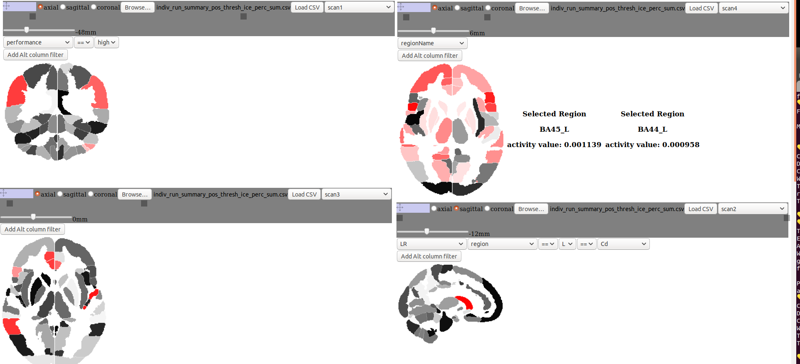
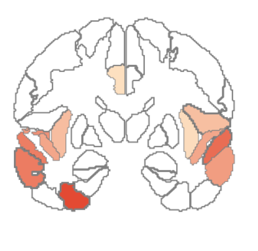

# Neuroimaging Choropleth canvas tool

This repository contains the development of a research imaging tool allowing researchers to quickly compare scan data overlaid on a normalized brain map.

## Steps for setup

* Clone this repo
* Run ```npm install```
* Start up the program using ```npm run start```
* Navigate to localhost:8080

**most recent**

**older**



## Better Setup

Navigate to this link http://129.114.17.151:8080/. Presently doesn't want to accept files because of cross origin fetching issues, but that is going to be worked on shortly!
