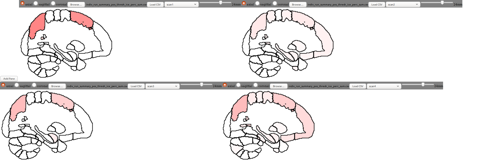

# Neuroimaging Choropleth canvas tool

This repository contains the development of a research imaging tool allowing researchers to quickly compare scan data overlaid on a normalized brain map.

## Steps for setup

* Clone this repo
* Run ```npm install```
* Start up the program using ```npm run start```
* Navigate to localhost:8080




